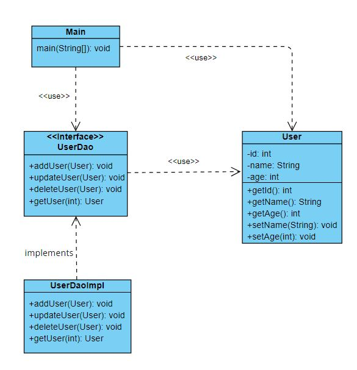

Паттерн Data Access Object (DAO) позволяет изолировать логику доступа к данным от прикладной бизнес-логики.
Реализация данного паттерна предполагает создание интерфейса, определяющего операции для взаимодействия
с данными, и класс, реализующий данный интерфейс. 

UML-диаграмма:

